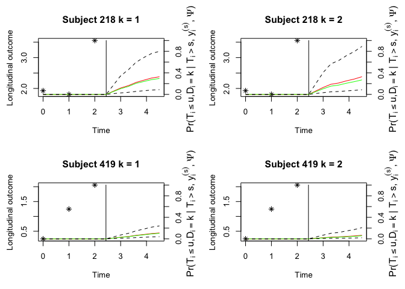

# FastJM

<!-- badges: start -->

[](https://github.com/shanpengli/FastJM/actions)
[](https://cran.r-project.org/package=FastJM)
[](https://cran.r-project.org/package=FastJM)
[](https://cran.r-project.org/package=FastJM)
<!-- badges: end -->

The `FastJM` package implement efficient computation of semi-parametric
joint model of longitudinal and competing risks data.

# Example

The `FastJM` package comes with several simulated datasets. To fit a
joint model, we use `jmcs` function.

``` r
require(FastJM)
#> Loading required package: FastJM
data(ydata)
data(cdata)
fit <- jmcs(ydata = ydata, cdata = cdata, 
            long.formula = response ~ time + gender + x1 + race, 
            surv.formula = Surv(surv, failure_type) ~ x1 + gender + x2 + race, 
            random =  ~ time| ID)
fit
#> 
#> Call:
#>  jmcs(ydata = ydata, cdata = cdata, long.formula = response ~ time + gender + x1 + race, random = ~time | ID, surv.formula = Surv(surv, failure_type) ~ x1 + gender + x2 + race) 
#> 
#> Data Summary:
#> Number of observations: 3067 
#> Number of groups: 1000 
#> 
#> Proportion of competing risks: 
#> Risk 1 : 34.9 %
#> Risk 2 : 29.8 %
#> 
#> Numerical intergration:
#> Method: pseudo-adaptive Guass-Hermite quadrature
#> Number of quadrature points:  6 
#> 
#> Model Type: joint modeling of longitudinal continuous and competing risks data 
#> 
#> Model summary:
#> Longitudinal process: linear mixed effects model
#> Event process: cause-specific Cox proportional hazard model with non-parametric baseline hazard
#> 
#> Loglikelihood:  -8989.389 
#> 
#> Fixed effects in the longitudinal sub-model:  response ~ time + gender + x1 + race 
#> 
#>             Estimate      SE   Z value  p-val
#> (Intercept)  2.01853 0.05704  35.38803 0.0000
#> time         0.98292 0.03147  31.22885 0.0000
#> genderMale  -0.07766 0.05860  -1.32527 0.1851
#> x1          -1.47810 0.05851 -25.26356 0.0000
#> raceWhite    0.04527 0.05911   0.76581 0.4438
#> 
#>         Estimate      SE  Z value  p-val
#> sigma^2  0.49182 0.01793 27.43751 0.0000
#> 
#> Fixed effects in the survival sub-model:  Surv(surv, failure_type) ~ x1 + gender + x2 + race 
#> 
#>              Estimate      SE   Z value  p-val
#> x1_1          0.54672 0.18540   2.94892 0.0032
#> genderMale_1 -0.18781 0.11935  -1.57359 0.1156
#> x2_1         -1.10450 0.12731  -8.67602 0.0000
#> raceWhite_1  -0.10027 0.11802  -0.84960 0.3955
#> x1_2          0.62986 0.20064   3.13927 0.0017
#> genderMale_2  0.10834 0.13065   0.82926 0.4070
#> x2_2         -1.76738 0.15245 -11.59296 0.0000
#> raceWhite_2   0.03194 0.13049   0.24479 0.8066
#> 
#> Association parameters:                 
#>               Estimate      SE Z value  p-val
#> (Intercept)_1  0.93973 0.12160 7.72809 0.0000
#> time_1         0.31691 0.19318 1.64051 0.1009
#> (Intercept)_2  0.96486 0.13646 7.07090 0.0000
#> time_2         0.03772 0.24137 0.15629 0.8758
#> 
#> 
#> Random effects:                 
#>   Formula: ~time | ID 
#>                  Estimate      SE  Z value  p-val
#> (Intercept)       0.52981 0.03933 13.47048 0.0000
#> time              0.25885 0.02262 11.44217 0.0000
#> (Intercept):time -0.02765 0.02529 -1.09330 0.2743
```

The `FastJM` package can make dynamic prediction given the longitudinal
history information. Below is a toy example for competing risks data.
Conditional cumulative incidence probabilities for each failure will be
presented.

``` r
ND <- ydata[ydata$ID %in% c(419, 218), ]
ID <- unique(ND$ID)
NDc <- cdata[cdata$ID  %in% ID, ]
survfit <- survfitjmcs(fit, 
                       ynewdata = ND, 
                       cnewdata = NDc, 
                       u = seq(3, 4.8, by = 0.2), 
                       M = 100,
                       seed = 100)
survfit
#> 
#> Prediction of Conditional Probabilities of Event
#>  based on 100 Monte Carlo samples
#> 
#> $`218`
#> $`218`$`Cumulative incidence probabilities for type 1 failure`
#>       times      Mean     Median   95%Lower  95%Upper
#> 1  2.441634 0.0000000 0.00000000 0.00000000 0.0000000
#> 2  3.000000 0.1011097 0.08410547 0.02777443 0.2735184
#> 3  3.200000 0.1237081 0.10463317 0.03459542 0.3279944
#> 4  3.400000 0.1563421 0.13565566 0.04492105 0.4017148
#> 5  3.600000 0.1883834 0.16708138 0.05565413 0.4678913
#> 6  3.800000 0.2158913 0.19173512 0.06538780 0.5196485
#> 7  4.000000 0.2326403 0.20724967 0.07156047 0.5488021
#> 8  4.200000 0.2552790 0.23093988 0.07984087 0.5852120
#> 9  4.400000 0.2585014 0.23437692 0.08104993 0.5901060
#> 10 4.600000 0.2864679 0.26476459 0.09193200 0.6292880
#> 11 4.800000 0.3043627 0.28524134 0.09932695 0.6508573
#> 
#> $`218`$`Cumulative incidence probabilities for type 2 failure`
#>       times      Mean    Median   95%Lower  95%Upper
#> 1  2.441634 0.0000000 0.0000000 0.00000000 0.0000000
#> 2  3.000000 0.1196325 0.1076966 0.03819324 0.2724097
#> 3  3.200000 0.1466832 0.1333463 0.04758002 0.3295669
#> 4  3.400000 0.1787812 0.1603982 0.05915467 0.3946457
#> 5  3.600000 0.1947699 0.1739598 0.06507768 0.4261853
#> 6  3.800000 0.2205814 0.1999267 0.07484881 0.4758583
#> 7  4.000000 0.2358501 0.2150752 0.08079950 0.5041055
#> 8  4.200000 0.2605746 0.2406434 0.09071798 0.5475497
#> 9  4.400000 0.2703617 0.2487820 0.09474765 0.5611128
#> 10 4.600000 0.2993897 0.2787364 0.10716024 0.5981571
#> 11 4.800000 0.3220236 0.3008394 0.11701378 0.6230989
#> 
#> 
#> $`419`
#> $`419`$`Cumulative incidence probabilities for type 1 failure`
#>       times       Mean     Median    95%Lower   95%Upper
#> 1  2.432155 0.00000000 0.00000000 0.000000000 0.00000000
#> 2  3.000000 0.02950634 0.02581952 0.009431856 0.06216023
#> 3  3.200000 0.03728638 0.03270007 0.011972591 0.07788376
#> 4  3.400000 0.04962709 0.04368116 0.016052170 0.10219769
#> 5  3.600000 0.06276904 0.05544928 0.020458560 0.12753052
#> 6  3.800000 0.07492886 0.06640489 0.024593444 0.15064314
#> 7  4.000000 0.08294673 0.07367062 0.027353535 0.16577697
#> 8  4.200000 0.09465484 0.08434118 0.031433479 0.18750781
#> 9  4.400000 0.09641350 0.08595035 0.032051538 0.19073357
#> 10 4.600000 0.11319393 0.10140396 0.038025247 0.22092938
#> 11 4.800000 0.12487455 0.11224034 0.042256156 0.24160595
#> 
#> $`419`$`Cumulative incidence probabilities for type 2 failure`
#>       times       Mean     Median    95%Lower   95%Upper
#> 1  2.432155 0.00000000 0.00000000 0.000000000 0.00000000
#> 2  3.000000 0.02064427 0.01813368 0.008225745 0.04844721
#> 3  3.200000 0.02589782 0.02280113 0.010362325 0.06051828
#> 4  3.400000 0.03256815 0.02875451 0.013098519 0.07570212
#> 5  3.600000 0.03617213 0.03199210 0.014593461 0.08381885
#> 6  3.800000 0.04252245 0.03773910 0.017260626 0.09795560
#> 7  4.000000 0.04653798 0.04128297 0.018962591 0.10680937
#> 8  4.200000 0.05351520 0.04732463 0.021925708 0.12203303
#> 9  4.400000 0.05645805 0.04986343 0.023178607 0.12839290
#> 10 4.600000 0.06570980 0.05830889 0.027145177 0.14819258
#> 11 4.800000 0.07393740 0.06571867 0.030721969 0.16544759
```

Plot the cumulative incidence function for each failure with the
historical longitudinal observations.

``` r
oldpar <- par(mfrow = c(2, 2), mar = c(5, 4, 4, 4))
plot(survfit, estimator = "both", include.y = TRUE)
```

<!-- -->

``` r
par(oldpar)
```
