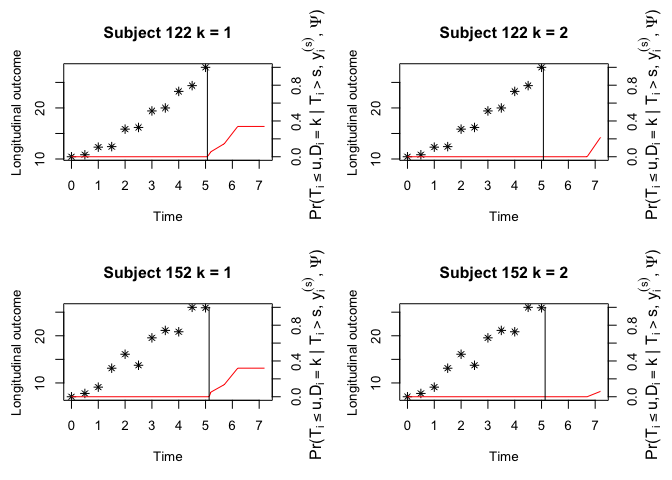

# FastJM

<!-- badges: start -->

[](https://github.com/shanpengli/FastJM/actions)
[](https://cran.r-project.org/package=FastJM)
[](https://cran.r-project.org/package=FastJM)
[](https://cran.r-project.org/package=FastJM)
[](https://cran.r-project.org/package=FastJM)
<!-- badges: end -->

The `FastJM` package implements efficient computation of semi-parametric
joint model of longitudinal and competing risks data. To view a brief
guide on the purpose and use of this package, please refer to our
[introductory video](https://youtu.be/sspYjUATICM?si=idTbVgT5DswN-yhe).

# Examples

## Single-biomarker joint model (`jmcs`)

The `FastJM` package comes with several simulated datasets. To fit a
joint model, we use `jmcs` function. In the example below, we are using
the following built-in data sets:

- ydata: longitudinal data for a **single** biomarker per patient
- cdata: competing risks time-to-event data per patient

``` r
require(FastJM)
require(survival)
data(ydata)
data(cdata)
fit <- jmcs(ydata = ydata, cdata = cdata, 
            long.formula = response ~ time + gender + x1 + race, 
            surv.formula = Surv(surv, failure_type) ~ x1 + gender + x2 + race, 
            random =  ~ time| ID)
fit
#> 
#> Call:
#>  jmcs(ydata = ydata, cdata = cdata, long.formula = response ~ time + gender + x1 + race, random = ~time | ID, surv.formula = Surv(surv, failure_type) ~ x1 + gender + x2 + race) 
#> 
#> Data Summary:
#> Number of observations: 3067 
#> Number of groups: 1000 
#> 
#> Proportion of competing risks: 
#> Risk 1 : 34.9 %
#> Risk 2 : 29.8 %
#> 
#> Numerical intergration:
#> Method: pseudo-adaptive Guass-Hermite quadrature
#> Number of quadrature points:  6 
#> 
#> Model Type: joint modeling of longitudinal continuous and competing risks data 
#> 
#> Model summary:
#> Longitudinal process: linear mixed effects model
#> Event process: cause-specific Cox proportional hazard model with non-parametric baseline hazard
#> 
#> Loglikelihood:  -8989.389 
#> 
#> Fixed effects in the longitudinal sub-model:  response ~ time + gender + x1 + race 
#> 
#>             Estimate      SE   Z value  p-val
#> (Intercept)  2.01853 0.05704  35.38803 0.0000
#> time         0.98292 0.03147  31.22885 0.0000
#> genderMale  -0.07766 0.05860  -1.32527 0.1851
#> x1          -1.47810 0.05851 -25.26356 0.0000
#> raceWhite    0.04527 0.05911   0.76581 0.4438
#> 
#>         Estimate      SE  Z value  p-val
#> sigma^2  0.49182 0.01793 27.43751 0.0000
#> 
#> Fixed effects in the survival sub-model:  Surv(surv, failure_type) ~ x1 + gender + x2 + race 
#> 
#>              Estimate      SE   Z value  p-val
#> x1_1          0.54672 0.18540   2.94892 0.0032
#> genderMale_1 -0.18781 0.11935  -1.57359 0.1156
#> x2_1         -1.10450 0.12731  -8.67602 0.0000
#> raceWhite_1  -0.10027 0.11802  -0.84960 0.3955
#> x1_2          0.62986 0.20064   3.13927 0.0017
#> genderMale_2  0.10834 0.13065   0.82926 0.4070
#> x2_2         -1.76738 0.15245 -11.59296 0.0000
#> raceWhite_2   0.03194 0.13049   0.24479 0.8066
#> 
#> Association parameters:                 
#>               Estimate      SE Z value  p-val
#> (Intercept)_1  0.93973 0.12160 7.72809 0.0000
#> time_1         0.31691 0.19318 1.64051 0.1009
#> (Intercept)_2  0.96486 0.13646 7.07090 0.0000
#> time_2         0.03772 0.24137 0.15629 0.8758
#> 
#> 
#> Random effects:                 
#>   Formula: ~time | ID 
#>                  Estimate      SE  Z value  p-val
#> (Intercept)       0.52981 0.03933 13.47048 0.0000
#> time              0.25885 0.02262 11.44217 0.0000
#> (Intercept):time -0.02765 0.02529 -1.09330 0.2743
```

The `FastJM` package can make dynamic prediction given the longitudinal
history information. Below is a toy example for competing risks data.
Conditional cumulative incidence probabilities for each failure will be
presented.

``` r
ND <- ydata[ydata$ID %in% c(419, 218), ]
ID <- unique(ND$ID)
NDc <- cdata[cdata$ID  %in% ID, ]
survfit <- survfitjmcs(fit, 
                       ynewdata = ND, 
                       cnewdata = NDc, 
                       u = seq(3, 4.8, by = 0.2), 
                       method = "GH",
                       obs.time = "time")
survfit
#> 
#> Prediction of Conditional Probabilities of Event
#> based on the pseudo-adaptive Guass-Hermite quadrature rule with 6 quadrature points
#> $`218`
#>       times       CIF1      CIF2
#> 1  2.441634 0.00000000 0.0000000
#> 2  3.000000 0.09629588 0.1110072
#> 3  3.200000 0.11862304 0.1369133
#> 4  3.400000 0.15142590 0.1679708
#> 5  3.600000 0.18413127 0.1839693
#> 6  3.800000 0.21269800 0.2096528
#> 7  4.000000 0.23043413 0.2249182
#> 8  4.200000 0.25459317 0.2500146
#> 9  4.400000 0.25811390 0.2599361
#> 10 4.600000 0.28856883 0.2896654
#> 11 4.800000 0.30829095 0.3134531
#> 
#> $`419`
#>       times       CIF1       CIF2
#> 1  2.432155 0.00000000 0.00000000
#> 2  3.000000 0.02972511 0.02073398
#> 3  3.200000 0.03757608 0.02601222
#> 4  3.400000 0.05003929 0.03270990
#> 5  3.600000 0.06332292 0.03635232
#> 6  3.800000 0.07563241 0.04273814
#> 7  4.000000 0.08376596 0.04677029
#> 8  4.200000 0.09564633 0.05378957
#> 9  4.400000 0.09743720 0.05674168
#> 10 4.600000 0.11449841 0.06602758
#> 11 4.800000 0.12639379 0.07432217
```

To assess the prediction accuracy of the fitted joint model, we may run
`DynPredAccjmcs` to assess the prediction accuracy by calculating all
available evaluation metrics.

``` r
res <- DynPredAccjmcs(
  object = fit,
  landmark.time = 3,
  horizon.time = c(3.6, 4, 4.4),
  obs.time = "time",
  method = "GH",
  maxiter = 1000,
  n.cv = 3,
  survinitial = TRUE,
  quantile.width = 0.25,
  metrics = c("AUC", "Cindex", "Brier", "MAE", "MAEQ")
)
#> The 1-th validation is done!
#> The 2-th validation is done!
#> The 3-th validation is done!

summary(res, metric = "Brier")
#> 
#> Expected Brier Score at the landmark time of 3 
#> based on 3 fold cross validation
#>   Horizon Time Brier Score 1 Brier Score 2
#> 1          3.6        0.0589        0.0348
#> 2          4.0        0.0889        0.0543
#> 3          4.4        0.1052        0.0687
summary(res, metric = "MAE")
#> 
#> Expected mean absolute error at the landmark time of 3 
#> based on 3 fold cross validation
#>   Horizon Time   MAE1   MAE2
#> 1          3.6 0.1188 0.0699
#> 2          4.0 0.1765 0.1085
#> 3          4.4 0.2090 0.1387
summary(res, metric = "MAEQ")
#> 
#> Mean absolute error across quantiles of predicted risk scores at the landmark time of 3 
#> based on 3 fold cross validation
#>   Horizon Time  MAEQ1  MAEQ2
#> 1          3.6 0.0208 0.0301
#> 2          4.0 0.0446 0.0403
#> 3          4.4 0.0477 0.0379
summary(res, metric = "AUC")
#> 
#> Expected AUC at the landmark time of 3 
#> based on 3 fold cross validation
#>   Horizon Time   AUC1   AUC2
#> 1          3.6 0.7367 0.7097
#> 2          4.0 0.7155 0.6760
#> 3          4.4 0.7337 0.7255
summary(res, metric = "Cindex")
#> 
#> Expected Cindex at the landmark time of 3 
#> based on 3 fold cross validation
#>   Horizon Time Cindex1 Cindex2
#> 1          3.6  0.6864  0.6773
#> 2          4.0  0.6860  0.6765
#> 3          4.4  0.6862  0.6758
```

Or we can calculate the overall, time-independent Cindex over the entire
time period, evaluated by the linear predictor of the (cause-specific)
Cox model.

``` r
Concord <- Concordancejmcs(seed = 100, fit, n.cv = 3)
#> The 1 th validation is done!
#> The 2 th validation is done!
#> The 3 th validation is done!
summary(Concord)
#>   Concordance1 Concordance2
#> 1    0.6721619    0.7037879
```

## Multi-biomarker Joint Model (`mvjmcs`)

To fit a joint model with multiple longitudinal outcomes and competing
risks, we can use the `mvjmcs` function. In the example below, we are
using the following built-in data sets:

- mvydata: longitudinal data for **multiple** biomarkers per patient
- mvcdata: competing risks time-to-event data per patient

``` r
data(mvydata)
data(mvcdata)
mvfit <- mvjmcs(ydata = mvydata, cdata = mvcdata,
              long.formula = list(Y1 ~ X11 + X12 + time,
                                  Y2 ~ X11 + X12 + time),
              random = list(~ time | ID,
                            ~ 1 | ID),
              surv.formula = Surv(survtime, cmprsk) ~ X21 + X22)
#> runtime is:
#> Time difference of 33.2904 secs
mvfit
#> 
#> Call:
#>  mvjmcs(ydata = mvydata, cdata = mvcdata, long.formula = list(Y1 ~ X11 + X12 + time, Y2 ~ X11 + X12 + time), random = list(~time | ID, ~1 | ID), surv.formula = Surv(survtime, cmprsk) ~ X21 + X22) 
#> 
#> Data Summary:
#> Number of observations: 5645 
#> Number of groups: 800 
#> 
#> Proportion of competing risks: 
#> Risk 1 : 41.62 %
#> Risk 2 : 11.25 %
#> 
#> Model Type: joint modeling of multivariate longitudinal continuous and competing risks data 
#> 
#> Model summary:
#> Longitudinal process: linear mixed effects model
#> Event process: cause-specific Cox proportional hazard model with non-parametric baseline hazard
#> 
#> Fixed effects in the longitudinal sub-model:  list(Y1 ~ X11 + X12 + time, Y2 ~ X11 + X12 + time) 
#> 
#>                  Estimate      SE   Z value  p-val
#> (Intercept)_bio1  4.97836 0.05389  92.37830 0.0000
#> X11_bio1          1.46373 0.08052  18.17736 0.0000
#> X12_bio1          1.99688 0.01430 139.68697 0.0000
#> time_bio1         0.83770 0.03951  21.20086 0.0000
#> (Intercept)_bio2  9.97514 0.04927 202.47202 0.0000
#> X11_bio2          0.97968 0.07331  13.36384 0.0000
#> X12_bio2          2.00928 0.01309 153.45755 0.0000
#> time_bio2         0.99382 0.00455 218.62849 0.0000
#> 
#>              Estimate      SE    Z value  p-val
#> sigma^2_bio1  0.49302 0.00018 2729.81717 0.0000
#> sigma^2_bio2  0.49757 0.00965   51.54934 0.0000
#> 
#> Fixed effects in the survival sub-model:  Surv(survtime, cmprsk) ~ X21 + X22 
#> 
#>       Estimate      SE  Z value  p-val
#> X21_1  0.92687 0.13465  6.88331 0.0000
#> X22_1  0.50892 0.03163 16.08946 0.0000
#> X21_2 -0.22126 0.24916 -0.88800 0.3745
#> X22_2  0.48336 0.05920  8.16466 0.0000
#> 
#> Association parameters:                 
#>                   Estimate      SE  Z value  p-val
#> (Intercept)_1bio1  0.49735 0.07539  6.59671 0.0000
#> time_1bio1         0.70010 0.08498  8.23809 0.0000
#> (Intercept)_1bio2 -0.54465 0.07972 -6.83163 0.0000
#> (Intercept)_2bio1  0.63098 0.13344  4.72857 0.0000
#> time_2bio1         0.65771 0.16710  3.93611 0.0001
#> (Intercept)_2bio2 -0.48306 0.15877 -3.04259 0.0023
#> 
#> 
#> Random effects:                 
#>   bio 1 :  ~time | ID 
#>   bio 2 :  ~1 | ID 
#>                       Estimate      SE  Z value  p-val
#> Intercept1             1.02128 0.06470 15.78547 0.0000
#> time1                  0.91442 0.05819 15.71410 0.0000
#> Intercept2             0.88199 0.05324 16.56595 0.0000
#> Intercept1:time1      -0.09442 0.04533 -2.08271 0.0373
#> Intercept1:Intercept2  0.04355 0.04051  1.07499 0.2824
#> time1:Intercept2      -0.06492 0.04223 -1.53739 0.1242
```

We can extract the components of the model as follows:

``` r
# Longitudinal fixed effects
fixef(mvfit, process = "Longitudinal")
#> (Intercept)_bio1         X11_bio1         X12_bio1        time_bio1 (Intercept)_bio2         X11_bio2         X12_bio2 
#>        4.9783622        1.4637306        1.9968810        0.8377000        9.9751421        0.9796767        2.0092771 
#>        time_bio2 
#>        0.9938159
summary(mvfit, process = "Longitudinal")
#>        Longitudinal   coef     SE 95%Lower 95%Upper p-values
#> 1  (Intercept)_bio1 4.9784 0.0539   4.8727   5.0840        0
#> 2          X11_bio1 1.4637 0.0805   1.3059   1.6216        0
#> 3          X12_bio1 1.9969 0.0143   1.9689   2.0249        0
#> 4         time_bio1 0.8377 0.0395   0.7603   0.9151        0
#> 5  (Intercept)_bio2 9.9751 0.0493   9.8786  10.0717        0
#> 6          X11_bio2 0.9797 0.0733   0.8360   1.1234        0
#> 7          X12_bio2 2.0093 0.0131   1.9836   2.0349        0
#> 8         time_bio2 0.9938 0.0045   0.9849   1.0027        0
#> 9      sigma^2_bio1 0.4930 0.0002   0.4927   0.4934        0
#> 10     sigma^2_bio2 0.4976 0.0097   0.4787   0.5165        0

# Survival fixed effects
fixef(mvfit, process = "Event")
#> $Risk1
#>     X21_1     X22_1 
#> 0.9268691 0.5089241 
#> 
#> $Risk2
#>      X21_2      X22_2 
#> -0.2212556  0.4833562
summary(mvfit, process = "Event")
#>             Survival    coef exp(coef) SE(coef) 95%Lower 95%Upper 95%exp(Lower) 95%exp(Upper) p-values
#> 1              X21_1  0.9269    2.5266   0.1347   0.6629   1.1908        1.9405        3.2897   0.0000
#> 2              X22_1  0.5089    1.6635   0.0316   0.4469   0.5709        1.5635        1.7699   0.0000
#> 3              X21_2 -0.2213    0.8015   0.2492  -0.7096   0.2671        0.4918        1.3062   0.3745
#> 4              X22_2  0.4834    1.6215   0.0592   0.3673   0.5994        1.4439        1.8210   0.0000
#> 5  (Intercept)_1bio1  0.4973    1.6444   0.0754   0.3496   0.6451        1.4185        1.9062   0.0000
#> 6         time_1bio1  0.7001    2.0139   0.0850   0.5335   0.8667        1.7049        2.3790   0.0000
#> 7  (Intercept)_1bio2 -0.5446    0.5800   0.0797  -0.7009  -0.3884        0.4961        0.6781   0.0000
#> 8  (Intercept)_2bio1  0.6310    1.8794   0.1334   0.3694   0.8925        1.4469        2.4413   0.0000
#> 9         time_2bio1  0.6577    1.9304   0.1671   0.3302   0.9852        1.3912        2.6784   0.0001
#> 10 (Intercept)_2bio2 -0.4831    0.6169   0.1588  -0.7942  -0.1719        0.4519        0.8421   0.0023

# Random effects for first few subjects
head(ranef(mvfit))
#>   (Intercept)_bio1   time_bio1 (Intercept)_bio2
#> 1        1.2319610 -0.52584340      -1.20371719
#> 2       -0.5308272 -0.32954734       1.56026919
#> 3       -1.1627322  0.33104170       0.17052091
#> 4       -1.4296389 -1.93508778      -0.09598218
#> 5        0.2379468 -1.94922572       0.02283060
#> 6       -0.1229965 -0.02043454       0.06420000
```

The `FastJM` package can now make dynamic prediction in the presence of
multiple longitudinal outcomes. Below is a toy example for competing
risks data. Conditional cumulative incidence probabilities for each
failure will be presented.

``` r
require(dplyr)
#> Loading required package: dplyr
#> 
#> Attaching package: 'dplyr'
#> The following object is masked from 'package:MASS':
#> 
#>     select
#> The following objects are masked from 'package:stats':
#> 
#>     filter, lag
#> The following objects are masked from 'package:base':
#> 
#>     intersect, setdiff, setequal, union
set.seed(08252025)
sampleID <- sample(mvcdata$ID, 5, replace = FALSE)

subcdata <- mvcdata %>%
  dplyr::filter(ID %in% sampleID)

subydata <- mvydata %>%
  dplyr::filter(ID %in% sampleID)

### Set up a landmark time of 4.75 and make predictions at time u
survmvfit <- survfitmvjmcs(mvfit, seed = 100, ynewdata = subydata, cnewdata = subcdata,
                         u = c(7, 8, 9), Last.time = 4.75, obs.time = "time")

survmvfit
#> 
#> Prediction of Conditional Probabilities of Event
#> based on the first order approximation
#> $`177`
#>   times       CIF1        CIF2
#> 1  4.75 0.00000000 0.000000000
#> 2  7.00 0.01861973 0.003167409
#> 3  8.00 0.02670221 0.004780677
#> 4  9.00 0.02981999 0.006005652
#> 
#> $`182`
#>   times      CIF1       CIF2
#> 1  4.75 0.0000000 0.00000000
#> 2  7.00 0.2460705 0.03392616
#> 3  8.00 0.3322085 0.04804826
#> 4  9.00 0.3626926 0.05807446
#> 
#> $`260`
#>   times       CIF1       CIF2
#> 1  4.75 0.00000000 0.00000000
#> 2  7.00 0.03340964 0.01753985
#> 3  8.00 0.04761368 0.02629538
#> 4  9.00 0.05303220 0.03288541
#> 
#> $`305`
#>   times       CIF1       CIF2
#> 1  4.75 0.00000000 0.00000000
#> 2  7.00 0.02891562 0.01545646
#> 3  8.00 0.04126797 0.02320727
#> 4  9.00 0.04599079 0.02905144
#> 
#> $`800`
#>   times       CIF1        CIF2
#> 1  4.75 0.00000000 0.000000000
#> 2  7.00 0.01309319 0.002113995
#> 3  8.00 0.01880334 0.003195467
#> 4  9.00 0.02101032 0.004017890
```

## Single-biomarker joint model in the presence of heterogeneous within-subject variability (`JMMLSM`)

- ydatah: longitudinal data for a **single** biomarker per patient
- cdatah: competing risks time-to-event data per patient

``` r
data(ydatah)
data(cdatah)
## fit a joint model
fit <- JMMLSM(cdata = cdatah, ydata = ydatah, 
              long.formula = Y ~ Z1 + Z2 + Z3 + time,
              surv.formula = Surv(survtime, cmprsk) ~ var1 + var2 + var3,
              variance.formula = ~ Z1 + Z2 + Z3 + time, 
              random = ~ 1|ID)
fit
#> 
#> Call:
#>  JMMLSM(cdata = cdatah, ydata = ydatah, long.formula = Y ~ Z1 + Z2 + Z3 + time, surv.formula = Surv(survtime, cmprsk) ~ var1 + var2 + var3, variance.formula = ~Z1 + Z2 + Z3 + time, random = ~1 | ID) 
#> 
#> Data Summary:
#> Number of observations: 1353 
#> Number of groups: 200 
#> 
#> Proportion of competing risks: 
#> Risk 1 : 45.5 %
#> Risk 2 : 32.5 %
#> 
#> Numerical intergration:
#> Method:  adaptive Guass-Hermite quadrature
#> Number of quadrature points:  6 
#> 
#> Model Type: joint modeling of longitudinal continuous and competing risks data with the presence of intra-individual variability 
#> 
#> Model summary:
#> Longitudinal process: Mixed effects location scale model
#> Event process: cause-specific Cox proportional hazard model with non-parametric baseline hazard
#> 
#> Loglikelihood:  -3621.603 
#> 
#> Fixed effects in mean of longitudinal submodel:  Y ~ Z1 + Z2 + Z3 + time 
#> 
#>             Estimate      SE   Z value  p-val
#> (Intercept)  4.85342 0.12451  38.97918 0.0000
#> Z1           1.55235 0.16535   9.38841 0.0000
#> Z2           1.93774 0.14598  13.27409 0.0000
#> Z3           1.09289 0.05321  20.53796 0.0000
#> time         4.01129 0.02978 134.71376 0.0000
#> 
#> Fixed effects in variance of longitudinal submodel:  log(sigma^2) ~ Z1 + Z2 + Z3 + time 
#> 
#>             Estimate      SE  Z value  p-val
#> (Intercept)  0.50745 0.12838  3.95260 0.0001
#> Z1           0.50509 0.16005  3.15590 0.0016
#> Z2          -0.42508 0.13781 -3.08463 0.0020
#> Z3           0.14405 0.04494  3.20563 0.0013
#> time         0.09050 0.02422  3.73720 0.0002
#> 
#> Survival sub-model fixed effects:  Surv(survtime, cmprsk) ~ var1 + var2 + var3 
#> 
#>        Estimate      SE Z value  p-val
#> var1_1  1.09710 0.32647 3.36051 0.0008
#> var2_1  0.19237 0.26154 0.73553 0.4620
#> var3_1  0.49611 0.08908 5.56951 0.0000
#>                                        
#> var1_2 -0.88311 0.33702 -2.62037 0.0088
#> var2_2  0.80905 0.30127  2.68549 0.0072
#> var3_2  0.20871 0.09312  2.24143 0.0250
#> 
#> Association parameters:                 
#>                   Estimate      SE  Z value  p-val
#> (Intercept)_1      0.97480 0.62808  1.55202 0.1207
#> (Intercept)_2     -0.18580 0.47949 -0.38750 0.6984
#> var_(Intercept)_1  0.50030 0.58190  0.85977 0.3899
#> var_(Intercept)_2 -0.84481 0.52520 -1.60857 0.1077
#> 
#> 
#> Random effects:                 
#>   Formula: ~1 | ID 
#>                             Estimate      SE Z value  p-val
#> (Intercept)                  0.49542 0.11339 4.36913 0.0000
#> var_(Intercept)              0.45581 0.11129 4.09578 0.0000
#> (Intercept):var_(Intercept)  0.26738 0.07854 3.40429 0.0007
```

``` r
cnewdata <- cdatah[cdatah$ID %in% c(122, 152), ]
ynewdata <- ydatah[ydatah$ID %in% c(122, 152), ]
survfit <- survfitJMMLSM(fit, seed = 100, ynewdata = ynewdata, cnewdata = cnewdata, 
                         u = seq(5.2, 7.2, by = 0.5), Last.time = "survtime",
                         obs.time = "time", method = "GH")
survfit
#> 
#> Prediction of Conditional Probabilities of Event
#> based on the  adaptive  Guass-Hermite quadrature rule with 6 quadrature points
#> $`122`
#>      times       CIF1      CIF2
#> 1 5.069089 0.00000000 0.0000000
#> 2 5.200000 0.05596021 0.0000000
#> 3 5.700000 0.14584944 0.0000000
#> 4 6.200000 0.33882152 0.0000000
#> 5 6.700000 0.33882152 0.0000000
#> 6 7.200000 0.33882152 0.2171424
#> 
#> $`152`
#>      times      CIF1       CIF2
#> 1 5.133665 0.0000000 0.00000000
#> 2 5.200000 0.0517717 0.00000000
#> 3 5.700000 0.1357406 0.00000000
#> 4 6.200000 0.3195265 0.00000000
#> 5 6.700000 0.3195265 0.00000000
#> 6 7.200000 0.3195265 0.06007945
oldpar <- par(mfrow = c(2, 2), mar = c(5, 4, 4, 4))
plot(survfit, include.y = TRUE)
```

<!-- -->

``` r
par(oldpar)
```

To assess the prediction accuracy of the fitted joint model, we may run
`DynPredAccJMMLSM` to assess the prediction accuracy by calculating all
available evaluation metrics.

``` r
res <- DynPredAccJMMLSM(
  object = fit,
  landmark.time = 3, horizon.time = c(4:6),
  obs.time = "time",
  method = "GH",
  maxiter = 1000,
  n.cv = 3,
  quantile.width = 0.25,
  metrics = c("AUC", "Cindex", "Brier", "MAE", "MAEQ")
)
#> The 1-th validation is done!
#> The 2-th validation is done!
#> The 3-th validation is done!

summary(res, metric = "Brier")
#> 
#> Expected Brier Score at the landmark time of 3 
#> based on 3 fold cross validation
#>   Horizon Time Brier Score 1 Brier Score 2
#> 4            4        0.0637        0.0619
#> 5            5        0.1084        0.1105
#> 6            6        0.2019        0.1161
summary(res, metric = "MAE")
#> 
#> Expected mean absolute error at the landmark time of 3 
#> based on 3 fold cross validation
#>   Horizon Time   MAE1   MAE2
#> 4            4 0.1314 0.1258
#> 5            5 0.2192 0.2195
#> 6            6 0.3818 0.2291
summary(res, metric = "MAEQ")
#> 
#> Mean absolute error across quantiles of predicted risk scores at the landmark time of 3 
#> based on 3 fold cross validation
#>   Horizon Time  MAEQ1  MAEQ2
#> 1            4 0.0965 0.0656
#> 2            5 0.1190 0.0864
#> 3            6 0.1139 0.1074
summary(res, metric = "AUC")
#> 
#> Expected AUC at the landmark time of 3 
#> based on 3 fold cross validation
#>   Horizon Time   AUC1   AUC2
#> 4            4 0.5502 0.6839
#> 5            5 0.6182 0.6524
#> 6            6 0.6104 0.7066
summary(res, metric = "Cindex")
#> 
#> Expected Cindex at the landmark time of 3 
#> based on 3 fold cross validation
#>   Horizon Time Cindex1 Cindex2
#> 4            4  0.6154  0.6510
#> 5            5  0.6133  0.6463
#> 6            6  0.6126  0.6463
```

Or we can calculate the overall, time-independent Cindex over the entire
time period, evaluated by the linear predictor of the (cause-specific)
Cox model.

``` r
Concord <- ConcordanceJMMLSM(seed = 100, fit, n.cv = 3)
#> The 1 th validation is done!
#> The 2 th validation is done!
#> The 3 th validation is done!
summary(Concord)
#>   Concordance1 Concordance2
#> 1    0.7943508    0.7413602
```

### Simulate Data (Optional)

In order to create simulated data for `mvjmcs`, we can use the
`simmvJMdata` function, which creates longitudinal and survival data as
a nested list (which are unpacked the this example). When first calling
the function, it provides censoring and risk rates.

``` r
# Simulate data
  sim <- simmvJMdata(seed = 100, N = 50) # returns list of cdata and ydata for a sample size of 50
#> The censoring rate is: 44%
#> The risk 1 rate is: 48%
#> The risk 2 rate is: 8%
  c_data <- sim$mvcdata # survival-side data, one row per ID
  y_data <- sim$mvydata # longitudinal measurements (multiple rows per ID)
```

Below is the simulated longitudinal data for **multiple** biomarkers,
wherein Y1 and Y2 represent our biomarkers and X11 and X12 represent
measurement-level predictors for the longitudinal submodel.

``` r
head(y_data)
#>   ID time       Y1       Y2 X11       X12
#> 1  1  0.0 2.325975 3.493627   0 -2.347892
#> 2  1  0.7 2.328122 4.649502   0 -2.347892
#> 3  1  1.4 2.793674 6.112850   0 -2.347892
#> 4  1  2.1 2.221392 5.375753   0 -2.347892
#> 5  1  2.8 1.864348 4.481401   0 -2.347892
#> 6  1  3.5 3.988955 5.496069   0 -2.347892
```

Below is the simulated survival data wherein X21 and X22 represent
patient-level predictors for the survival model.

``` r
head(c_data)
#>   ID   survtime cmprsk X21        X22
#> 1  1 6.10116281      0   0 -2.3478921
#> 2  2 0.05456028      1   1  0.1826885
#> 3  3 6.52978656      0   1  2.3791087
#> 4  4 0.04942950      1   1  2.7961091
#> 5  5 6.96785721      0   0 -3.8530560
#> 6  6 7.20378227      0   0  1.1237335
```
