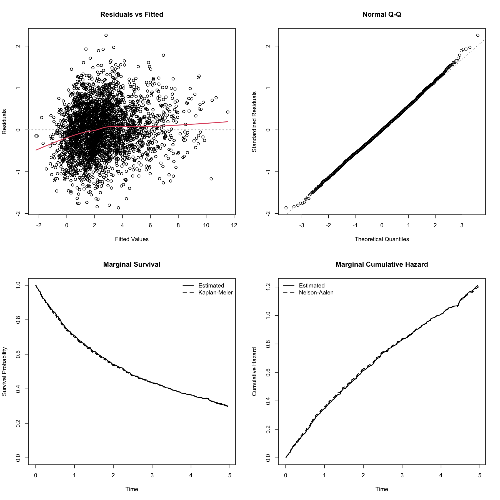
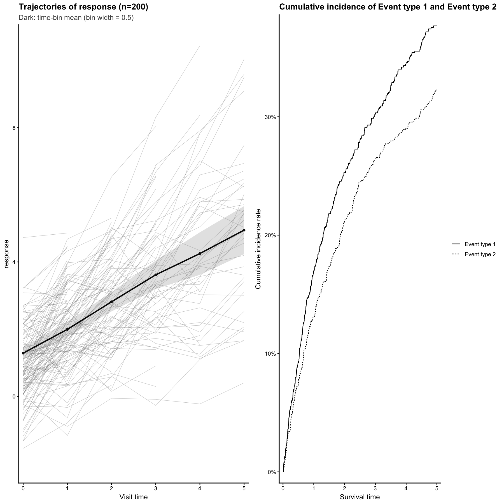
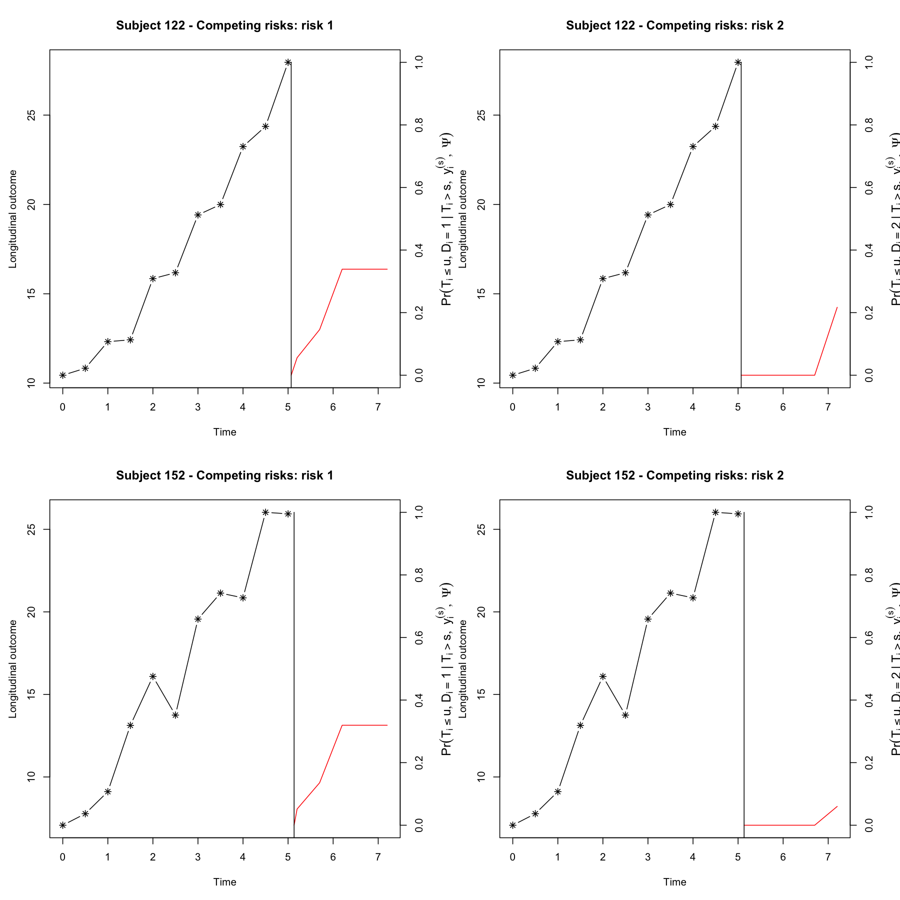

# FastJM

<!-- badges: start -->

[](https://github.com/shanpengli/FastJM/actions)
[](https://cran.r-project.org/package=FastJM)
[](https://cran.r-project.org/package=FastJM)
[](https://cran.r-project.org/package=FastJM)
[](https://cran.r-project.org/package=FastJM)
<!-- badges: end -->

The `FastJM` package implements efficient computation of semi-parametric
joint model of longitudinal and competing risks data. To view a brief
guide on the purpose and use of this package, please refer to our
[introductory video](https://youtu.be/sspYjUATICM?si=idTbVgT5DswN-yhe).

# Examples

## Single-biomarker joint model (`jmcs`)

The `FastJM` package comes with several simulated datasets. To fit a
joint model, we use `jmcs` function. In the example below, we are using
the following built-in data sets:

- ydata: longitudinal data for a **single** biomarker per patient
- cdata: competing risks time-to-event data per patient

``` r
require(FastJM)
require(survival)
data(ydata)
data(cdata)
fit <- jmcs(ydata = ydata, cdata = cdata, 
            long.formula = response ~ time + gender + x1 + race, 
            surv.formula = Surv(surv, failure_type) ~ x1 + gender + x2 + race, 
            random =  ~ time| ID)
fit
#> 
#> Call:
#>  jmcs(ydata = ydata, cdata = cdata, long.formula = response ~ time + gender + x1 + race, random = ~time | ID, surv.formula = Surv(surv, failure_type) ~ x1 + gender + x2 + race) 
#> 
#> Data Summary:
#> Number of observations: 3067 
#> Number of groups: 1000 
#> 
#> Proportion of competing risks: 
#> Risk 1 : 34.9 %
#> Risk 2 : 29.8 %
#> 
#> Numerical intergration:
#> Method: pseudo-adaptive Guass-Hermite quadrature
#> Number of quadrature points:  6 
#> 
#> Model Type: joint modeling of longitudinal continuous and competing risks data 
#> 
#> Model summary:
#> Longitudinal process: linear mixed effects model
#> Event process: cause-specific Cox proportional hazard model with non-parametric baseline hazard
#> 
#> Loglikelihood:  -8989.389 
#> 
#> Fixed effects in the longitudinal sub-model:  response ~ time + gender + x1 + race 
#> 
#>             Estimate     SE  Z value  p-val
#> (Intercept)   2.0185 0.0570  35.3880 0.0000
#> time          0.9829 0.0315  31.2289 0.0000
#> genderMale   -0.0777 0.0586  -1.3253 0.1851
#> x1           -1.4781 0.0585 -25.2636 0.0000
#> raceWhite     0.0453 0.0591   0.7658 0.4438
#> 
#> Residual error:
#>          Variance StdDev
#> Residual   0.4918 0.7013
#> 
#> Fixed effects in the survival sub-model:  Surv(surv, failure_type) ~ x1 + gender + x2 + race 
#> 
#>              Estimate     SE  Z value  p-val
#> x1_1           0.5467 0.1854   2.9489 0.0032
#> genderMale_1  -0.1878 0.1194  -1.5736 0.1156
#> x2_1          -1.1045 0.1273  -8.6760 0.0000
#> raceWhite_1   -0.1003 0.1180  -0.8496 0.3955
#> x1_2           0.6299 0.2006   3.1393 0.0017
#> genderMale_2   0.1083 0.1307   0.8293 0.4070
#> x2_2          -1.7674 0.1525 -11.5930 0.0000
#> raceWhite_2    0.0319 0.1305   0.2448 0.8066
#> 
#> Association parameters:                 
#>               Estimate     SE Z value  p-val
#> (Intercept)_1   0.9397 0.1216  7.7281 0.0000
#> time_1          0.3169 0.1932  1.6405 0.1009
#> (Intercept)_2   0.9649 0.1365  7.0709 0.0000
#> time_2          0.0377 0.2414  0.1563 0.8758
#> 
#> Random effects:                 
#>   Formula: ~time | ID 
#>             StdDev  (Intr)
#> (Intercept) 0.7279        
#> time        0.5088 -0.0747
```

The fitted `jmcs` object also provides a standard diagnostic plotting
method through `plot()`. This function displays four panels:
subject-specific residuals for the longitudinal process versus their
corresponding fitted values; a normal Q-Q plot of the residuals of the
standardized subject-specific residuals for the longitudinal process, an
estimate of the marginal survival function for the event process, and an
estimate of the marginal cumulative risk function for the event process.
These plots provide a quick graphical summary of the longitudinal
residual behavior and the estimated event-time process from the fitted
joint model.

``` r
plot(fit)
```


We can further examine the fitted joint model using diagnostic plots.
The `timeplot()` function displays the longitudinal biomarker
trajectories, the empirical log residual variance over follow-up time,
and the event process. For competing-risk models, the event plot is
shown as cumulative incidence curves for the specified event types.

The log residual variance plot is intended as an exploratory diagnostic.
Apparent changes over time may reflect departures from constant residual
variance, but they may also be affected by finite-sample variability,
model fit, or changing subject composition over follow-up.

``` r
crplot <- timeplot(
  object = fit,
  biomarker = response,
  id_col = ID,
  time_col = time,
  time_bin_width = 0.5,
  fail_code = 1,
  cr_code = 2,
  censor_code = 0,
  primary_event_label = "Event type 1",
  competing_event_label = "Event type 2",
  x_lab = "Visit time",
  event_x_lab = "Survival time",
  n.obs = 200
)
```



The `FastJM` package can make dynamic prediction given the longitudinal
history information. Below is a toy example for competing risks data.
Conditional cumulative incidence probabilities for each failure will be
presented.

``` r
ND <- ydata[ydata$ID %in% c(419, 218), ]
ID <- unique(ND$ID)
NDc <- cdata[cdata$ID  %in% ID, ]
survfit <- survfitJM(fit, 
                     ynewdata = ND, 
                     cnewdata = NDc, 
                     u = seq(3, 4.8, by = 0.2), 
                     method = "GH",
                     obs.time = "time")
survfit
#> 
#> Prediction of Conditional Probabilities of Event
#> based on the pseudo-adaptive Gauss-Hermite quadrature rule with 6 quadrature points
#> $`218`
#>       times       CIF1      CIF2
#> 1  2.441634 0.00000000 0.0000000
#> 2  3.000000 0.09629588 0.1110072
#> 3  3.200000 0.11862304 0.1369133
#> 4  3.400000 0.15142590 0.1679708
#> 5  3.600000 0.18413127 0.1839693
#> 6  3.800000 0.21269800 0.2096528
#> 7  4.000000 0.23043413 0.2249182
#> 8  4.200000 0.25459317 0.2500146
#> 9  4.400000 0.25811390 0.2599361
#> 10 4.600000 0.28856883 0.2896654
#> 11 4.800000 0.30829095 0.3134531
#> 
#> $`419`
#>       times       CIF1       CIF2
#> 1  2.432155 0.00000000 0.00000000
#> 2  3.000000 0.02972511 0.02073398
#> 3  3.200000 0.03757608 0.02601222
#> 4  3.400000 0.05003929 0.03270990
#> 5  3.600000 0.06332292 0.03635232
#> 6  3.800000 0.07563241 0.04273814
#> 7  4.000000 0.08376596 0.04677029
#> 8  4.200000 0.09564633 0.05378957
#> 9  4.400000 0.09743720 0.05674168
#> 10 4.600000 0.11449841 0.06602758
#> 11 4.800000 0.12639379 0.07432217
```

To assess the prediction accuracy of the fitted joint model, we may run
`DynPredAcc` to assess the prediction accuracy by calculating all
available evaluation metrics.

``` r
res <- DynPredAcc(
  object = fit,
  landmark.time = 3,
  horizon.time = c(3.6, 4, 4.4),
  obs.time = "time",
  method = "GH",
  maxiter = 1000,
  n.cv = 3,
  quantile.width = 0.25,
  metrics = c("AUC", "Cindex", "Brier Score", "MAE", "MAEQ")
)
#> The 1-th validation is done!
#> The 2-th validation is done!
#> The 3-th validation is done!

summary(res, metric = "Brier Score")
#> 
#> Expected Brier Score at the landmark time of 3 
#> based on 3 fold cross validation
#>   Horizon Time Brier Score 1 Brier Score 2
#> 1          3.6        0.0589        0.0348
#> 2          4.0        0.0889        0.0543
#> 3          4.4        0.1052        0.0687
summary(res, metric = "MAE")
#> 
#> Expected mean absolute error at the landmark time of 3 
#> based on 3 fold cross validation
#>   Horizon Time   MAE1   MAE2
#> 1          3.6 0.1188 0.0699
#> 2          4.0 0.1765 0.1085
#> 3          4.4 0.2090 0.1387
summary(res, metric = "MAEQ")
#> 
#> Mean absolute error across quantiles of predicted risk scores at the landmark time of 3 
#> based on 3 fold cross validation
#>   Horizon Time  MAEQ1  MAEQ2
#> 1          3.6 0.0208 0.0301
#> 2          4.0 0.0446 0.0403
#> 3          4.4 0.0477 0.0379
summary(res, metric = "AUC")
#> 
#> Expected AUC at the landmark time of 3 
#> based on 3 fold cross validation
#>   Horizon Time   AUC1   AUC2
#> 1          3.6 0.7367 0.7097
#> 2          4.0 0.7155 0.6760
#> 3          4.4 0.7337 0.7255
summary(res, metric = "Cindex")
#> 
#> Expected Cindex at the landmark time of 3 
#> based on 3 fold cross validation
#>   Horizon Time Cindex1 Cindex2
#> 1          3.6  0.6864  0.6773
#> 2          4.0  0.6860  0.6765
#> 3          4.4  0.6862  0.6758
```

Or we can calculate the overall, time-independent Cindex over the entire
time period, evaluated by the linear predictor of the (cause-specific)
Cox model.

``` r
Concord <- Concordance(seed = 100, fit, n.cv = 3)
#> The 1 th validation is done!
#> The 2 th validation is done!
#> The 3 th validation is done!
summary(Concord)
#>   Concordance1 Concordance2
#> 1       0.6722       0.7038
```

## Multi-biomarker Joint Model (`mvjmcs`)

To fit a joint model with multiple longitudinal outcomes and competing
risks, we can use the `mvjmcs` function. In the example below, we are
using the following built-in data sets:

- mvydata: longitudinal data for **multiple** biomarkers per patient
- mvcdata: competing risks time-to-event data per patient

``` r
data(mvydata)
data(mvcdata)
mvfit <- mvjmcs(ydata = mvydata, cdata = mvcdata,
              long.formula = list(Y1 ~ X11 + X12 + time,
                                  Y2 ~ X11 + X12 + time),
              random = list(~ time | ID,
                            ~ 1 | ID),
              surv.formula = Surv(survtime, cmprsk) ~ X21 + X22)
mvfit
#> 
#> Call:
#>  mvjmcs(ydata = mvydata, cdata = mvcdata, long.formula = list(Y1 ~ X11 + X12 + time, Y2 ~ X11 + X12 + time), random = list(~time | ID, ~1 | ID), surv.formula = Surv(survtime, cmprsk) ~ X21 + X22) 
#> 
#> Data Summary:
#> Number of observations: 5645 
#> Number of groups: 800 
#> 
#> Proportion of competing risks: 
#> Risk 1 : 41.62 %
#> Risk 2 : 11.25 %
#> 
#> Model Type: joint modeling of multivariate longitudinal continuous and competing risks data 
#> 
#> Model summary:
#> Runtime: 24.32 seconds 
#> Longitudinal process: linear mixed effects model
#> Event process: cause-specific Cox proportional hazard model with non-parametric baseline hazard
#> 
#> Fixed effects in the longitudinal sub-model:  list(Y1 ~ X11 + X12 + time, Y2 ~ X11 + X12 + time) 
#> 
#>                  Estimate     SE  Z value  p-val
#> (Intercept)_bio1   4.9784 0.0539  92.3924 0.0000
#> X11_bio1           1.4637 0.0805  18.1883 0.0000
#> X12_bio1           1.9969 0.0143 140.0902 0.0000
#> time_bio1          0.8377 0.0393  21.3266 0.0000
#> (Intercept)_bio2   9.9751 0.0492 202.6236 0.0000
#> X11_bio2           0.9797 0.0732  13.3747 0.0000
#> X12_bio2           2.0093 0.0131 153.4394 0.0000
#> time_bio2          0.9938 0.0046 218.0964 0.0000
#> 
#> 
#> Residual error:
#>            Variance StdDev
#> sigma_bio1   0.4930 0.7022
#> sigma_bio2   0.4976 0.7054
#> 
#> Fixed effects in the survival sub-model:  Surv(survtime, cmprsk) ~ X21 + X22 
#> 
#>       Estimate     SE Z value  p-val
#> X21_1   0.9269 0.1343  6.9040 0.0000
#> X22_1   0.5089 0.0310 16.3917 0.0000
#> X21_2  -0.2213 0.2490 -0.8885 0.3743
#> X22_2   0.4834 0.0588  8.2153 0.0000
#> 
#> Association parameters:                 
#>                   Estimate     SE Z value  p-val
#> (Intercept)_1bio1   0.4973 0.0750  6.6293 0.0000
#> time_1bio1          0.7001 0.0839  8.3437 0.0000
#> (Intercept)_1bio2  -0.5446 0.0794 -6.8592 0.0000
#> (Intercept)_2bio1   0.6310 0.1333  4.7326 0.0000
#> time_2bio1          0.6577 0.1663  3.9540 0.0001
#> (Intercept)_2bio2  -0.4831 0.1585 -3.0485 0.0023
#> 
#> 
#> Random effects:                 
#>   bio 1 :  ~time | ID 
#>   bio 2 :  ~1 | ID 
#>            StdDev   Intr1   time1
#> Intercept1 1.0106                
#> time1      0.9563 -0.0977        
#> Intercept2 0.9391  0.0459 -0.0723
```

We can extract the components of the model as follows:

``` r
# Longitudinal fixed effects
fixef(mvfit, process = "Longitudinal")
#> (Intercept)_bio1         X11_bio1         X12_bio1 
#>        4.9783622        1.4637306        1.9968810 
#>        time_bio1 (Intercept)_bio2         X11_bio2 
#>        0.8377000        9.9751421        0.9796767 
#>         X12_bio2        time_bio2 
#>        2.0092771        0.9938159
summary(mvfit, process = "Longitudinal")
#>        Longitudinal   coef     SE 95%Lower 95%Upper p-values
#> 1  (Intercept)_bio1 4.9784 0.0539   4.8728   5.0840        0
#> 2          X11_bio1 1.4637 0.0805   1.3060   1.6215        0
#> 3          X12_bio1 1.9969 0.0143   1.9689   2.0248        0
#> 4         time_bio1 0.8377 0.0393   0.7607   0.9147        0
#> 5  (Intercept)_bio2 9.9751 0.0492   9.8787  10.0716        0
#> 6          X11_bio2 0.9797 0.0732   0.8361   1.1232        0
#> 7          X12_bio2 2.0093 0.0131   1.9836   2.0349        0
#> 8         time_bio2 0.9938 0.0046   0.9849   1.0027        0
#> 9      sigma^2_bio1 0.4930 0.0110   0.4715   0.5145        0
#> 10     sigma^2_bio2 0.4976 0.0106   0.4769   0.5183        0

# Survival fixed effects
fixef(mvfit, process = "Event")
#> $Risk1
#>     X21_1     X22_1 
#> 0.9268691 0.5089241 
#> 
#> $Risk2
#>      X21_2      X22_2 
#> -0.2212556  0.4833562
summary(mvfit, process = "Event")
#>             Survival    coef exp(coef) SE(coef) 95%Lower
#> 1              X21_1  0.9269    2.5266   0.1343   0.6637
#> 2              X22_1  0.5089    1.6635   0.0310   0.4481
#> 3              X21_2 -0.2213    0.8015   0.2490  -0.7094
#> 4              X22_2  0.4834    1.6215   0.0588   0.3680
#> 5  (Intercept)_1bio1  0.4973    1.6444   0.0750   0.3503
#> 6         time_1bio1  0.7001    2.0139   0.0839   0.5356
#> 7  (Intercept)_1bio2 -0.5446    0.5800   0.0794  -0.7003
#> 8  (Intercept)_2bio1  0.6310    1.8794   0.1333   0.3697
#> 9         time_2bio1  0.6577    1.9304   0.1663   0.3317
#> 10 (Intercept)_2bio2 -0.4831    0.6169   0.1585  -0.7936
#>    95%Upper 95%exp(Lower) 95%exp(Upper) p-values
#> 1    1.1900        1.9420        3.2871   0.0000
#> 2    0.5698        1.5653        1.7679   0.0000
#> 3    0.2669        0.4920        1.3058   0.3743
#> 4    0.5987        1.4449        1.8197   0.0000
#> 5    0.6444        1.4195        1.9048   0.0000
#> 6    0.8646        1.7085        2.3740   0.0000
#> 7   -0.3890        0.4964        0.6777   0.0000
#> 8    0.8923        1.4472        2.4407   0.0000
#> 9    0.9837        1.3933        2.6744   0.0001
#> 10  -0.1725        0.4522        0.8416   0.0023

# Random effects for first few subjects
head(ranef(mvfit))
#>   (Intercept)_bio1   time_bio1 (Intercept)_bio2
#> 1        1.2319610 -0.52584340      -1.20371719
#> 2       -0.5308272 -0.32954734       1.56026919
#> 3       -1.1627322  0.33104170       0.17052091
#> 4       -1.4296389 -1.93508778      -0.09598218
#> 5        0.2379468 -1.94922572       0.02283060
#> 6       -0.1229965 -0.02043454       0.06420000
```

The `FastJM` package can now make dynamic prediction in the presence of
multiple longitudinal outcomes. Below is a toy example for competing
risks data. Conditional cumulative incidence probabilities for each
failure will be presented.

``` r
require(dplyr)
#> Loading required package: dplyr
#> Warning: package 'dplyr' was built under R version 4.4.3
#> 
#> Attaching package: 'dplyr'
#> The following object is masked from 'package:MASS':
#> 
#>     select
#> The following objects are masked from 'package:stats':
#> 
#>     filter, lag
#> The following objects are masked from 'package:base':
#> 
#>     intersect, setdiff, setequal, union
set.seed(08252025)
sampleID <- sample(mvcdata$ID, 5, replace = FALSE)

subcdata <- mvcdata %>%
  dplyr::filter(ID %in% sampleID)

subydata <- mvydata %>%
  dplyr::filter(ID %in% sampleID)

### Set up a landmark time of 4.75 and make predictions at time u
survmvfit <- survfitJM(mvfit, seed = 100, ynewdata = subydata, cnewdata = subcdata,
                       u = c(7, 8, 9), Last.time = 4.75, obs.time = "time")

survmvfit
#> 
#> Prediction of Conditional Probabilities of Event
#> based on the first order approximation
#> $`177`
#>   times       CIF1        CIF2
#> 1  4.75 0.00000000 0.000000000
#> 2  7.00 0.01861973 0.003167409
#> 3  8.00 0.02670221 0.004780677
#> 4  9.00 0.02981999 0.006005652
#> 
#> $`182`
#>   times      CIF1       CIF2
#> 1  4.75 0.0000000 0.00000000
#> 2  7.00 0.2460705 0.03392616
#> 3  8.00 0.3322085 0.04804826
#> 4  9.00 0.3626926 0.05807446
#> 
#> $`260`
#>   times       CIF1       CIF2
#> 1  4.75 0.00000000 0.00000000
#> 2  7.00 0.03340964 0.01753985
#> 3  8.00 0.04761368 0.02629538
#> 4  9.00 0.05303220 0.03288541
#> 
#> $`305`
#>   times       CIF1       CIF2
#> 1  4.75 0.00000000 0.00000000
#> 2  7.00 0.02891562 0.01545646
#> 3  8.00 0.04126797 0.02320727
#> 4  9.00 0.04599079 0.02905144
#> 
#> $`800`
#>   times       CIF1        CIF2
#> 1  4.75 0.00000000 0.000000000
#> 2  7.00 0.01309319 0.002113995
#> 3  8.00 0.01880334 0.003195467
#> 4  9.00 0.02101032 0.004017890
```

To assess the prediction accuracy of the fitted joint model, we may run
`DynPredAcc` to assess the prediction accuracy by calculating all
available evaluation metrics.

``` r
res <- DynPredAcc(
  object = mvfit,
  landmark.time = 3,
  horizon.time = c(3.6, 4, 4.4),
  obs.time = "time",
  maxiter = 1000,
  n.cv = 3,
  quantile.width = 0.25,
  metrics = c("AUC", "Cindex", "Brier Score", "MAE", "MAEQ")
)
#> The 1-th validation is done!
#> The 2-th validation is done!
#> The 3-th validation is done!

summary(res, metric = "Brier Score")
#> 
#> Expected Brier Score at the landmark time of 3 
#> based on 3 fold cross validation
#>     Horizon Time Brier Score 1 Brier Score 2
#> 3.6          3.6        0.0395        0.0101
#> 4            4.0        0.0555        0.0143
#> 4.4          4.4        0.0669        0.0266
summary(res, metric = "MAE")
#> 
#> Expected mean absolute error at the landmark time of 3 
#> based on 3 fold cross validation
#>     Horizon Time   MAE1   MAE2
#> 3.6          3.6 0.0793 0.0204
#> 4            4.0 0.1122 0.0284
#> 4.4          4.4 0.1349 0.0515
summary(res, metric = "MAEQ")
#> 
#> Mean absolute error across quantiles of predicted risk scores at the landmark time of 3 
#> based on 3 fold cross validation
#>   Horizon Time  MAEQ1  MAEQ2
#> 1          3.6 0.0202 0.0102
#> 2          4.0 0.0299 0.0172
#> 3          4.4 0.0381 0.0285
summary(res, metric = "AUC")
#> 
#> Expected AUC at the landmark time of 3 
#> based on 3 fold cross validation
#>     Horizon Time   AUC1   AUC2
#> 3.6          3.6 0.7981 0.7850
#> 4            4.0 0.8290 0.7786
#> 4.4          4.4 0.8313 0.7210
summary(res, metric = "Cindex")
#> 
#> Expected Cindex at the landmark time of 3 
#> based on 3 fold cross validation
#>     Horizon Time Cindex1 Cindex2
#> 3.6          3.6  0.8257  0.6914
#> 4            4.0  0.8256  0.6922
#> 4.4          4.4  0.8256  0.6927
```

### Landmark Multivariate Joint Model

An alternative approach to characterize flexible latent associations is
a landmark multivariate joint model, which specifies a landmark time so
that only subjects who remain event-free beyond the landmark time
contribute to the model fitting. Here, we consider the current value of
the latent process as the association structure in the survival
sub-model.

``` r
fit.mvlm <- mvjmcs(ydata = mvydata, cdata = mvcdata,
                   long.formula = list(Y1 ~ X11 + X12 + time,
                                       Y2 ~ X11 + X12 + time),
                   random = list(~ time | ID,
                            ~ 1 | ID),
                   surv.formula = Surv(survtime, cmprsk) ~ X21 + X22,
                   control = mvjmcs_control(opt = "optim",
                                            cpu.cores = parallel::detectCores()),
                   latAsso = "presentlp",
                   landmark = TRUE,
                   s = 4,
                   ytime = "time")
fit.mvlm
#> 
#> Call:
#>  mvjmcs(ydata = mvydata, cdata = mvcdata, long.formula = list(Y1 ~ X11 + X12 + time, Y2 ~ X11 + X12 + time), random = list(~time | ID, ~1 | ID), surv.formula = Surv(survtime, cmprsk) ~ X21 + X22, control = mvjmcs_control(opt = "optim", cpu.cores = parallel::detectCores()), latAsso = "presentlp", landmark = TRUE, s = 4, ytime = "time") 
#> 
#> Data Summary:
#> Number of observations: 4807 
#> Number of groups: 456 
#> 
#> Proportion of competing risks: 
#> Risk 1 : 12.94 %
#> Risk 2 : 4.39 %
#> 
#> Model Type: joint modeling of multivariate longitudinal continuous and competing risks data 
#> 
#> Model summary:
#> Landmark analysis: Yes (s = 4)
#> Latent association: current value of the latent process
#> Runtime: 29.1 seconds 
#> Longitudinal process: linear mixed effects model
#> Event process: cause-specific Cox proportional hazard model with non-parametric baseline hazard
#> 
#> Fixed effects in the longitudinal sub-model:  list(Y1 ~ X11 + X12 + time, Y2 ~ X11 + X12 + time) 
#> 
#>                  Estimate     SE  Z value  p-val
#> (Intercept)_bio1   4.8141 0.0748  64.3698 0.0000
#> X11_bio1           1.4570 0.1065  13.6839 0.0000
#> X12_bio1           1.9599 0.0225  87.1971 0.0000
#> time_bio1          0.7587 0.0425  17.8322 0.0000
#> (Intercept)_bio2  10.1952 0.0662 153.9137 0.0000
#> X11_bio2           1.0942 0.0942  11.6142 0.0000
#> X12_bio2           2.0754 0.0205 101.0122 0.0000
#> time_bio2          0.9942 0.0047 212.5735 0.0000
#> 
#> 
#> Residual error:
#>            Variance StdDev
#> sigma_bio1   0.4969 0.7049
#> sigma_bio2   0.5008 0.7076
#> 
#> Fixed effects in the survival sub-model:  Surv(survtime, cmprsk) ~ X21 + X22 
#> 
#>       Estimate     SE Z value  p-val
#> X21_1   0.9664 0.2775  3.4828 0.0005
#> X22_1   0.4980 0.0613  8.1181 0.0000
#> X21_2  -0.1052 0.5302 -0.1985 0.8427
#> X22_2   0.3997 0.1065  3.7511 0.0002
#> 
#> Association parameters:                 
#>             Estimate     SE Z value  p-val
#> alpha1_bio1   0.1866 0.0381  4.9005 0.0000
#> alpha1_bio2  -0.4616 0.2033 -2.2707 0.0232
#> alpha2_bio1   0.3217 0.0619  5.1987 0.0000
#> alpha2_bio2  -0.5145 0.2702 -1.9039 0.0569
#> 
#> 
#> Random effects:                 
#>   bio 1 :  ~time | ID 
#>   bio 2 :  ~1 | ID 
#>            StdDev   Intr1  time1
#> Intercept1 1.0057               
#> time1      0.9457 -0.1489       
#> Intercept2 0.9185  0.0581 0.0099
```

## Single-biomarker joint model in the presence of heterogeneous within-subject variability (`JMMLSM`)

- ydatah: longitudinal data for a **single** biomarker per patient
- cdatah: competing risks time-to-event data per patient

``` r
data(ydatah)
data(cdatah)
## fit a joint model
fit <- JMMLSM(cdata = cdatah, ydata = ydatah, 
              long.formula = Y ~ Z1 + Z2 + Z3 + time,
              surv.formula = Surv(survtime, cmprsk) ~ var1 + var2 + var3,
              variance.formula = ~ Z1 + Z2 + Z3 + time, 
              random = ~ 1|ID)
fit
#> 
#> Call:
#>  JMMLSM(cdata = cdatah, ydata = ydatah, long.formula = Y ~ Z1 + Z2 + Z3 + time, surv.formula = Surv(survtime, cmprsk) ~ var1 + var2 + var3, variance.formula = ~Z1 + Z2 + Z3 + time, random = ~1 | ID) 
#> 
#> Data Summary:
#> Number of observations: 1353 
#> Number of groups: 200 
#> 
#> Proportion of competing risks: 
#> Risk 1 : 45.5 %
#> Risk 2 : 32.5 %
#> 
#> Numerical intergration:
#> Method:  adaptive Guass-Hermite quadrature
#> Number of quadrature points:  6 
#> 
#> Model Type: joint modeling of longitudinal continuous and competing risks data with the presence of intra-individual variability 
#> 
#> Model summary:
#> Longitudinal process: Mixed effects location scale model
#> Event process: cause-specific Cox proportional hazard model with non-parametric baseline hazard
#> 
#> Loglikelihood:  -3621.603 
#> 
#> Fixed effects in mean of longitudinal submodel:  Y ~ Z1 + Z2 + Z3 + time 
#> 
#>             Estimate     SE  Z value  p-val
#> (Intercept)   4.8534 0.1245  38.9792 0.0000
#> Z1            1.5523 0.1653   9.3884 0.0000
#> Z2            1.9377 0.1460  13.2741 0.0000
#> Z3            1.0929 0.0532  20.5380 0.0000
#> time          4.0113 0.0298 134.7138 0.0000
#> 
#> Fixed effects in variance of longitudinal submodel:  log(sigma^2) ~ Z1 + Z2 + Z3 + time 
#> 
#>             Estimate     SE Z value  p-val
#> (Intercept)   0.5075 0.1284  3.9526 0.0001
#> Z1            0.5051 0.1600  3.1559 0.0016
#> Z2           -0.4251 0.1378 -3.0846 0.0020
#> Z3            0.1440 0.0449  3.2056 0.0013
#> time          0.0905 0.0242  3.7372 0.0002
#> 
#> Survival sub-model fixed effects:  Surv(survtime, cmprsk) ~ var1 + var2 + var3 
#> 
#>        Estimate     SE Z value  p-val
#> var1_1   1.0971 0.3265  3.3605 0.0008
#> var2_1   0.1924 0.2615  0.7355 0.4620
#> var3_1   0.4961 0.0891  5.5695 0.0000
#>                                     
#> var1_2 -0.8831 0.3370 -2.6204 0.0088
#> var2_2  0.8091 0.3013  2.6855 0.0072
#> var3_2  0.2087 0.0931  2.2414 0.0250
#> 
#> Association parameters:                 
#>                   Estimate     SE Z value  p-val
#> (Intercept)_1       0.9748 0.6281  1.5520 0.1207
#> (Intercept)_2      -0.1858 0.4795 -0.3875 0.6984
#> var_(Intercept)_1   0.5003 0.5819  0.8598 0.3899
#> var_(Intercept)_2  -0.8448 0.5252 -1.6086 0.1077
#> 
#> 
#> Random effects:                 
#>   Formula: ~1 | ID 
#>                 StdDev (Intr)
#> (Intercept)     0.7039       
#> var_(Intercept) 0.6751 0.5627
```

``` r
cnewdata <- cdatah[cdatah$ID %in% c(122, 152), ]
ynewdata <- ydatah[ydatah$ID %in% c(122, 152), ]
survfit <- survfitJM(fit, seed = 100, ynewdata = ynewdata, cnewdata = cnewdata, 
                     u = seq(5.2, 7.2, by = 0.5), Last.time = "survtime",
                     obs.time = "time", method = "GH")
survfit
#> 
#> Prediction of Conditional Probabilities of Event
#> based on the  adaptive  Gauss-Hermite quadrature rule with 6 quadrature points
#> $`122`
#>      times       CIF1      CIF2
#> 1 5.069089 0.00000000 0.0000000
#> 2 5.200000 0.05596021 0.0000000
#> 3 5.700000 0.14584944 0.0000000
#> 4 6.200000 0.33882152 0.0000000
#> 5 6.700000 0.33882152 0.0000000
#> 6 7.200000 0.33882152 0.2171424
#> 
#> $`152`
#>      times      CIF1       CIF2
#> 1 5.133665 0.0000000 0.00000000
#> 2 5.200000 0.0517717 0.00000000
#> 3 5.700000 0.1357406 0.00000000
#> 4 6.200000 0.3195265 0.00000000
#> 5 6.700000 0.3195265 0.00000000
#> 6 7.200000 0.3195265 0.06007945
oldpar <- par(mfrow = c(2, 2), mar = c(5, 4, 4, 4))
plot(survfit, include.y = TRUE)
```



``` r
par(oldpar)
```

To assess the prediction accuracy of the fitted joint model, we may run
`DynPredAcc` to assess the prediction accuracy by calculating all
available evaluation metrics.

``` r
res <- DynPredAcc(
  object = fit,
  landmark.time = 3, horizon.time = c(4:6),
  obs.time = "time",
  method = "GH",
  maxiter = 1000,
  n.cv = 3,
  quantile.width = 0.25,
  metrics = c("AUC", "Cindex", "Brier Score", "MAE", "MAEQ")
)
#> The 1-th validation is done!
#> The 2-th validation is done!
#> The 3-th validation is done!

summary(res, metric = "Brier Score")
#> 
#> Expected Brier Score at the landmark time of 3 
#> based on 3 fold cross validation
#>   Horizon Time Brier Score 1 Brier Score 2
#> 4            4        0.0637        0.0619
#> 5            5        0.1084        0.1105
#> 6            6        0.2019        0.1161
summary(res, metric = "MAE")
#> 
#> Expected mean absolute error at the landmark time of 3 
#> based on 3 fold cross validation
#>   Horizon Time   MAE1   MAE2
#> 4            4 0.1314 0.1258
#> 5            5 0.2192 0.2195
#> 6            6 0.3818 0.2291
summary(res, metric = "MAEQ")
#> 
#> Mean absolute error across quantiles of predicted risk scores at the landmark time of 3 
#> based on 3 fold cross validation
#>   Horizon Time  MAEQ1  MAEQ2
#> 1            4 0.0965 0.0656
#> 2            5 0.1190 0.0864
#> 3            6 0.1139 0.1074
summary(res, metric = "AUC")
#> 
#> Expected AUC at the landmark time of 3 
#> based on 3 fold cross validation
#>   Horizon Time   AUC1   AUC2
#> 4            4 0.5502 0.6839
#> 5            5 0.6182 0.6524
#> 6            6 0.6104 0.7066
summary(res, metric = "Cindex")
#> 
#> Expected Cindex at the landmark time of 3 
#> based on 3 fold cross validation
#>   Horizon Time Cindex1 Cindex2
#> 4            4  0.6154  0.6510
#> 5            5  0.6133  0.6463
#> 6            6  0.6126  0.6463
```

### Simulate Data (Optional)

In order to create simulated data for `mvjmcs`, we can use the
`simmvJMdata` function, which creates longitudinal and survival data as
a nested list (which are unpacked the this example). When first calling
the function, it provides censoring and risk rates.

``` r
# Simulate data
  sim <- simmvJMdata(seed = 100, N = 50) # returns list of cdata and ydata for a sample size of 50
#> The censoring rate is: 62%
#> The risk 1 rate is: 32%
#> The risk 2 rate is: 6%
  c_data <- sim$mvcdata # survival-side data, one row per ID
  y_data <- sim$mvydata # longitudinal measurements (multiple rows per ID)
```

Below is the simulated longitudinal data for **multiple** biomarkers,
wherein Y1 and Y2 represent our biomarkers and X11 and X12 represent
measurement-level predictors for the longitudinal submodel.

``` r
head(y_data)
#>   ID time        Y1         Y2 X1        X2
#> 1  1  0.0 -5.551971 -0.7761904  0 -4.794168
#> 2  1  0.7 -5.745701  0.8160435  0 -4.794168
#> 3  1  1.4 -3.862485  0.5496277  0 -4.794168
#> 4  1  2.1 -5.006962  0.3542386  0 -4.794168
#> 5  1  2.8 -4.058923  1.7075900  0 -4.794168
#> 6  1  3.5 -5.524530  1.1352901  0 -4.794168
```

Below is the simulated survival data wherein X21 and X22 represent
patient-level predictors for the survival model.

``` r
head(c_data)
#>   ID survtime cmprsk X1        X2
#> 1  1 7.556187      0  0 -4.794168
#> 2  2 6.388553      0  0 -3.290310
#> 3  3 6.803285      0  0  1.399665
#> 4  4 7.187639      0  0 -3.350215
#> 5  5 3.263251      1  1 -1.452772
#> 6  6 7.603049      0  0 -3.135735
```
